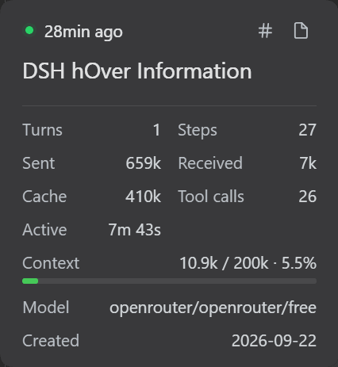

# @comecaramelos/dsh-hover-information

DSH plugin that makes the session hover card genuinely useful. The stock card
was a whole-surface "copy the title" button — rarely valuable. Now its header
row carries copy icons that sit in line with the status glyph and the elapsed
time, plus a configurable metrics block, all gated by a Settings → Plugins
card:



- **Copy session ID** / **Copy workspace path** icons on the card's header
  row — `⧉ copy ID` / `⧉ copy path` beside the status dot and the relative
  time, instead of the stock whole-card copy button. Clicking elsewhere on the
  card no longer copies the title (neutralized only on cards the plugin
  resolves — everything else stays stock).
- **Metrics block**: turns, steps, tokens sent/received, cache tokens,
  compactions, context window, subagents, model, tool calls, active time and
  created date — toggled per metric.
- **Document-preview header tools**: the sidebar's open-file panel grows two
  additional copy buttons: file content and file path.
- **Settings card**: master switch + per-metric toggles + refresh interval.

## Install

From npm (recommended, once published):

```sh
dsh plugin --profile web add @comecaramelos/dsh-hover-information
```

This adds the bundle's `hover-info` row to the profile's Cordis layer, along
with its defaults — the plugin is active immediately, with the default metrics
(turns, steps, tokens in/out, compactions, context, subagents, model) on and
nothing to configure. If you already have a `hover-info` row in
your profile's `cordis.patch.yml`, your row wins (later patches win by `id`).

Manual install (WSL + Windows pnpm, where the symlink step above fails):

```sh
mkdir -p ~/.dsh/profiles/web/node_modules/@comecaramelos
ln -s /path/to/dsh-hover-information \
  ~/.dsh/profiles/web/node_modules/@comecaramelos/dsh-hover-information
```

and add this to `~/.dsh/profiles/web/package.json`:

```json
{
  "dependencies": {
    "@comecaramelos/dsh-hover-information": "file:/path/to/dsh-hover-information"
  },
  "dsh": {
    "profile": {
      "bundles": [
        "@deepseek-ai/dsh-base",
        "@deepseek-ai/dsh-web-app",
        "@comecaramelos/dsh-hover-information"
      ]
    }
  }
}
```

Then restart `dsh web` — browser bundles don't hot-update in a live profile,
and the running gateway must not be restarted by tooling, so the GUI is
restarted by you. Never run `npm`/`pnpm install` inside the live profile:
it's a pnpm tree on a Windows mount and an install there breaks it.


---

[`CONTRIBUTING`](CONTRIBUTING.md) | [`LICENSE`](LICENSE.md)
