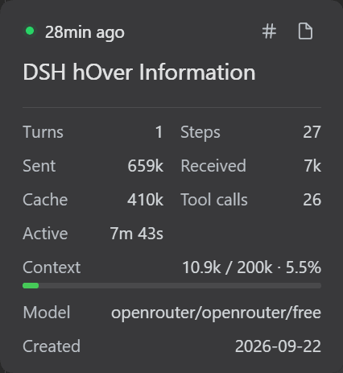

# @comecaramelos/dsh-hover-information

Aditional info in web UI.

**Preview card**

Configurable metrics block, all gated by a Settings → Plugins card:



- **Copy session ID** / **Copy workspace path** icons on the card's header
  row — `⧉ copy ID` / `⧉ copy path` beside the status dot and the relative
  time, instead of the stock whole-card copy button.
- **Metrics block**: turns, steps, tokens sent/received, cache tokens,
  compactions, purges (tool-result prunes), context window, subagents, model,
  tool calls, active time and created date — toggled per metric.

**Sidebar**

- **Document-preview header tools**: the sidebar's open-file panel grows two
  additional copy buttons: file content and file path.

**Background jobs**

- **Kill button on live jobs**: a ✕ on each running row in the session
  header's background-job list (cancel, not force).

**Model selector**

- **Provider in the selector**: tooltip and visible value read
  `Provider > Model`.

## Install

From npm:

```sh
dsh plugin --profile web add @comecaramelos/dsh-hover-information
```

Manual install:

```sh
mkdir -p ~/.dsh/profiles/web/node_modules/@comecaramelos
ln -s /path/to/dsh-hover-information \
  ~/.dsh/profiles/web/node_modules/@comecaramelos/dsh-hover-information
```

and add this to `~/.dsh/profiles/web/package.json`:

```json
{
  "dependencies": {
    "@comecaramelos/dsh-hover-information": "link:/path/to/dsh-hover-information"
  },
  "dsh": {
    "profile": {
      "bundles": [
        "@deepseek-ai/dsh-base",
        "@deepseek-ai/dsh-web-app",
        "@comecaramelos/dsh-hover-information"
      ]
    }
  }
}
```

Then restart the `web` host — browser bundles don't hot-update, and
the live `dsh web` gateway is never restarted by tooling.

## Develop

```sh
npm install
npm run build      # tsc (host) + tsc typecheck + esbuild (browser) → lib/
npm test           # builds first, then node --test
```

Sources live in `src/host/**` (host half) and `src/client/**` (browser half);
`src/index.ts` is the host's re-export-only face, and `scripts/build-client.mjs`
collapses the browser half into one `lib/client.js` lazy-CJS bundle. `lib/` is
build output and is git-ignored. Every consumer —
the profile row, the browser bundle and the tests — resolves it through
`package.json#exports`, so run the build after editing sources and before
pointing a profile checkout at this tree. See [`AGENTS.md`](AGENTS.md) 
for the layout and the verification recipe.

---

[`CONTRIBUTING`](CONTRIBUTING.md) | [`LICENSE`](LICENSE.md)
